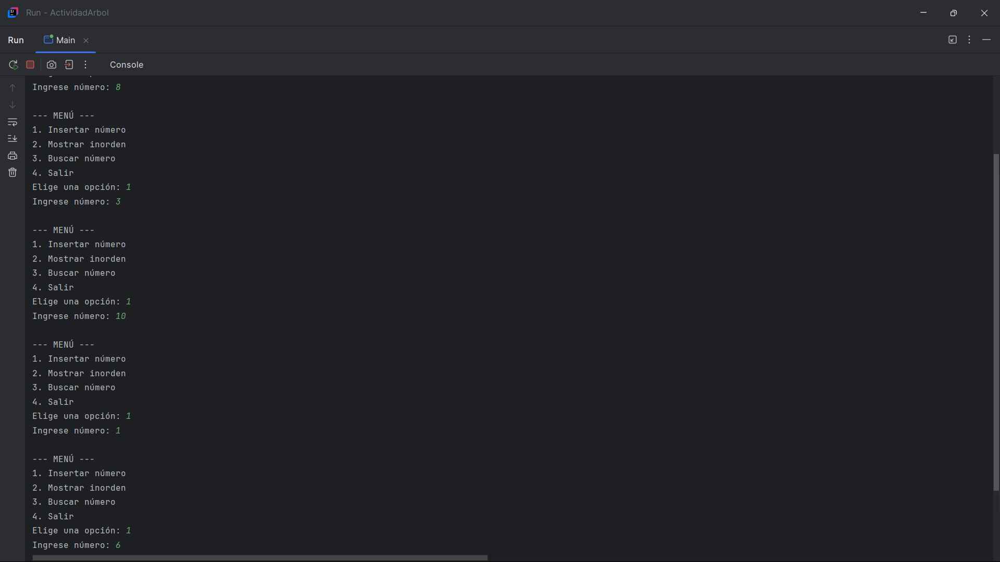
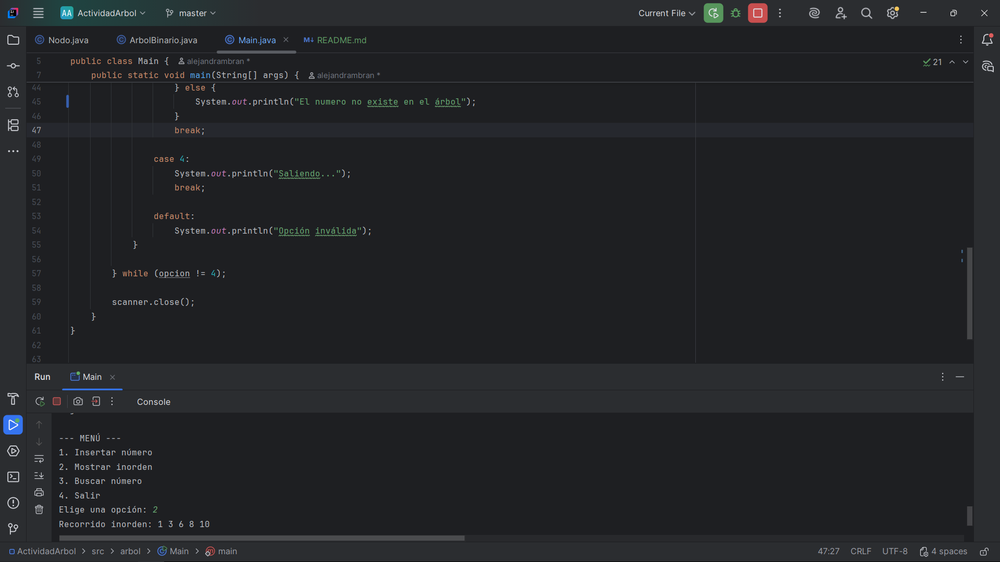
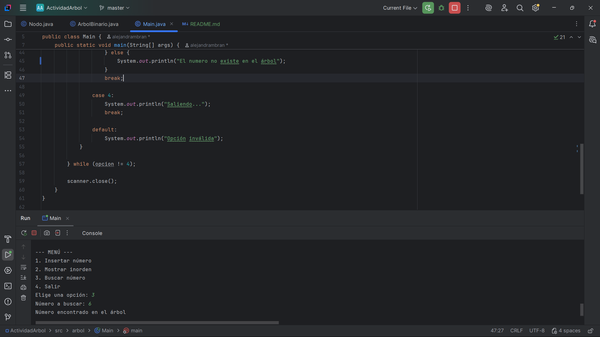
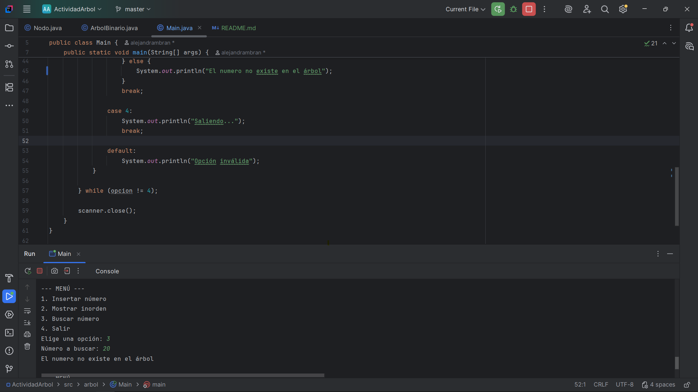

# Árbol Binario en Java

## Descripción

Este proyecto consiste en la implementación de un árbol binario en Java mediante un programa de consola.  
Permite insertar números, recorrerlos en inorden y buscar valores dentro del árbol.

Fue desarrollado en IntelliJ IDEA con el objetivo de comprender el funcionamiento de las estructuras de datos jerárquicas.

---

## ¿Qué es un árbol binario?

Un árbol binario es una estructura de datos organizada en forma jerárquica. Está compuesta por nodos, donde cada uno puede tener máximo dos hijos: izquierdo y derecho.

El primer nodo se conoce como raíz y a partir de este se construyen los demás niveles del árbol.

Es una estructura recursiva, ya que cada nodo puede considerarse como un árbol más pequeño.

---

## Funcionalidades

✔️ Insertar números  
✔️ Recorrido inorden (izquierda → raíz → derecha)  
✔️ Buscar un número  
✔️ Mostrar mensajes claros (encontrado / no existe)

---

## Estructura del proyecto

ActividadArbolBinario/
├── src/arbol
│ ├── Nodo.java
│ ├── ArbolBinario.java
│ └── Main.java
└── README.md

---

## Cómo ejecutar el proyecto

1. Clonar el repositorio:

   git clone https://github.com/alejandrambran/ActividadArbolBinario

2. Abrir el proyecto en IntelliJ IDEA

3. Ejecutar la clase `Main.java`

4. Usar el menú en consola

---

## Ejemplo de ejecución
MENÚ

1. Insertar número
2. Mostrar inorden
3. Buscar número
4. Salir

Ingrese número: 8
Ingrese número: 3
Ingrese número: 10
Ingrese número: 1
Ingrese número: 6

Recorrido inorden:
1 3 6 8 10

Número a buscar: 6
Número encontrado

Número a buscar: 20
No existe
---

## Evidencias

### Inserción de datos

### Recorrido inorden

### Búsqueda (encontrado)

### Búsqueda (no existe)

---

## Tecnologías

- Java
- IntelliJ IDEA
- GitHub

---

## Conclusión

Este proyecto permitió comprender cómo funcionan los árboles binarios y cómo se implementan en Java. Además, se reforzó el uso de la recursividad y la organización de datos de forma jerárquica.

---
## Autor

Yuly Alejandra Moreno Bran

Actividad académica - Estructura de Datos